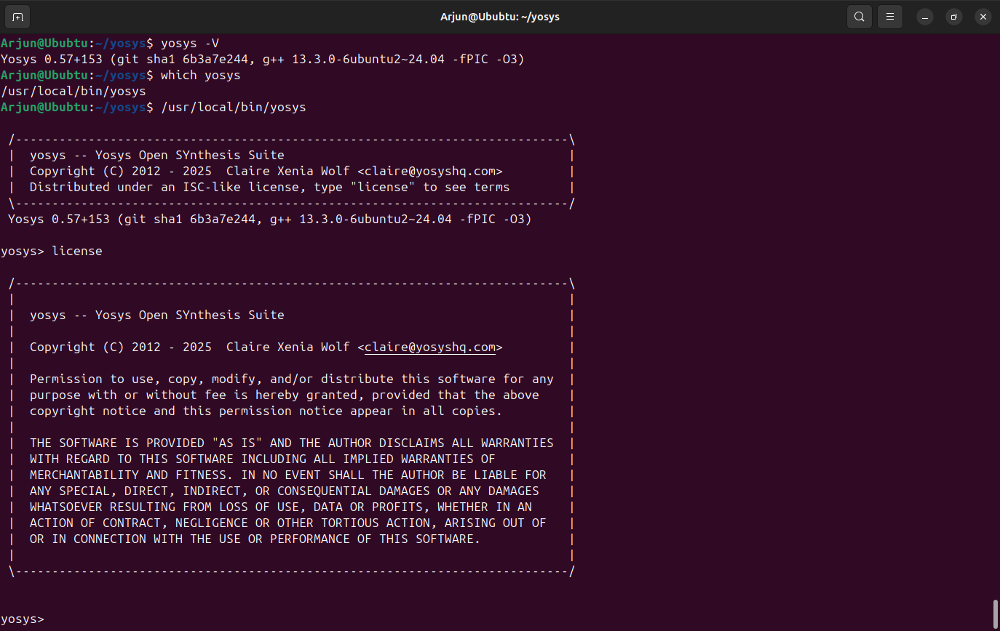
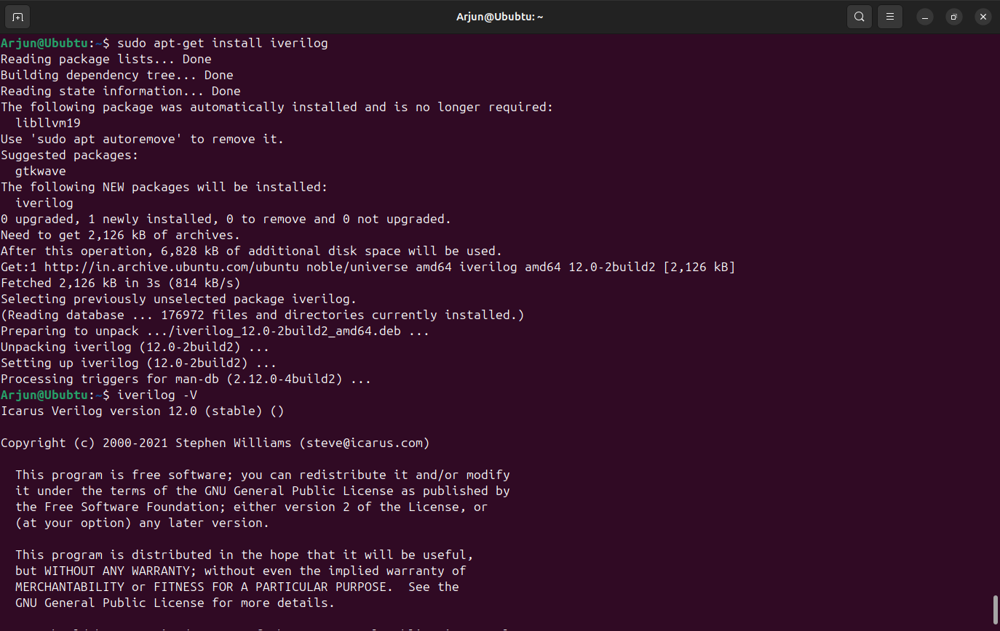
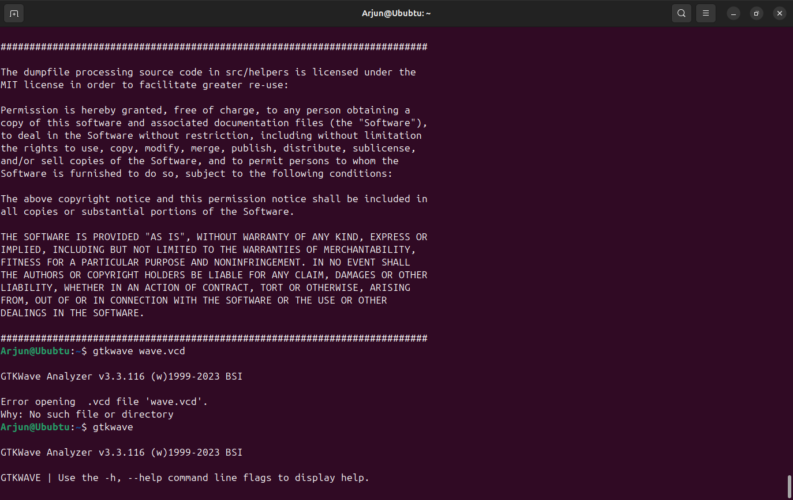
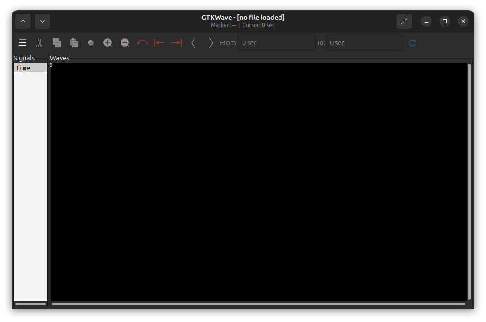

# 🌟 Week 0 / Task 1 — VSD Program Foundation & Tool Setup

Welcome to the beginning of my **RISC-V SoC Tapeout (VSD Program)** journey.  
This week was all about **building the environment** and **setting up essential tools** that will power my RTL-to-GDS design flow.

---

## 🖥️ Virtual Machine Configuration

A dedicated VM was configured to ensure smooth performance for synthesis, simulation, and waveform analysis.

| Resource | Configuration |
|----------|---------------|
| 🐧 **OS** | Ubuntu 20.04 LTS |
| 💾 **RAM** | 6 GB |
| 💿 **Storage** | 50 GB HDD |
| ⚡ **vCPUs** | 4 |

 **Why this setup?** → All are open source resources .Balanced resources for handling synthesis, running simulations, and debugging waveforms.

---

## ⚙️ Tools Installed & Verified

The following open-source tools were installed successfully:

| Tool | Purpose | Status |
|------|----------|--------|
| 🧠 **Yosys** | RTL synthesis (Verilog → Gate-level netlist) | ✔ Installed |
| 📟 **Icarus Verilog** | Compile & simulate Verilog designs | ✔ Installed |
| 📊 **GTKWave** | Waveform viewer for simulation results | ✔ Installed |

---

## 🔧 Installation Steps in Ubuntu

### 🧠 Yosys (RTL Synthesis Tool)

- `sudo apt-get update`  
- `git clone https://github.com/YosysHQ/yosys.git`  
- `cd yosys`  
- `sudo apt install make` 
- `sudo apt-get install build-essential clang bison flex \`  
  `libreadline-dev gawk tcl-dev libffi-dev git \`  
  `graphviz xdot pkg-config python3 libboost-system-dev \`  
  `libboost-python-dev libboost-filesystem-dev zlib1g-dev`  
- `make config-gcc`  
- `make`  
- `sudo make install`  

To Verify: `yosys -V`

### 📟 Icarus Verilog (Tool to Compile & simulate Verilog designs )

- `sudo apt-get update`  
- `sudo apt-get install iverilog`  

To Verify: `iverilog -V`

###  📊 GTKWave (Waveform viewer for simulation results)

- `sudo apt-get update`  
- `sudo apt install gtkwave`  

 Version check: `gtkwave --version`

 
     Waveform window

## ✅ Task 1 — Quick Recap

After completing the setup, here’s the outcome of my Week 0 / Task 1 work:

| 🚀 Tool | 🔍 Purpose | 📊 Status |
|---------|------------|-----------|
| 🧠 **Yosys** | RTL Synthesis | 🟢 Installed |
| 📟 **Icarus Verilog** | Verilog Simulation | 🟢 Installed |
| 📊 **GTKWave** | Waveform Visualization | 🟢 Installed |

---

### 🎯 Achievements
- 🖥️ Virtual Machine configured with Ubuntu 20.04  
- ⚙️ Installed and verified core tools for synthesis, simulation, and waveform analysis  
- 🚀 Established a solid foundation for the **VSD RISC-V SoC Tapeout Journey**  

---
  

📌 *This marks the start of my silicon design journey — the lab is ready, the tools are active, and the learning begins!
Excited for the journey ahed!*  

